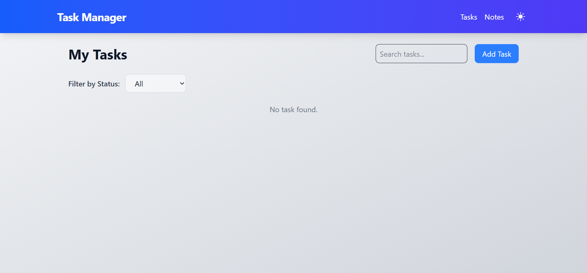

Task Manager Application
A full-stack web application designed to enhance skills in .NET Web API and React with Tailwind CSS. This project allows users to create, read, update, and delete tasks and notes, providing a practical experience with RESTful APIs, state management in React, and responsive UI design. It demonstrates hands-on knowledge of connecting a React frontend with a .NET backend and handling CRUD operations efficiently.

